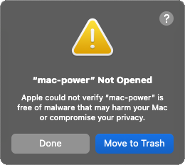
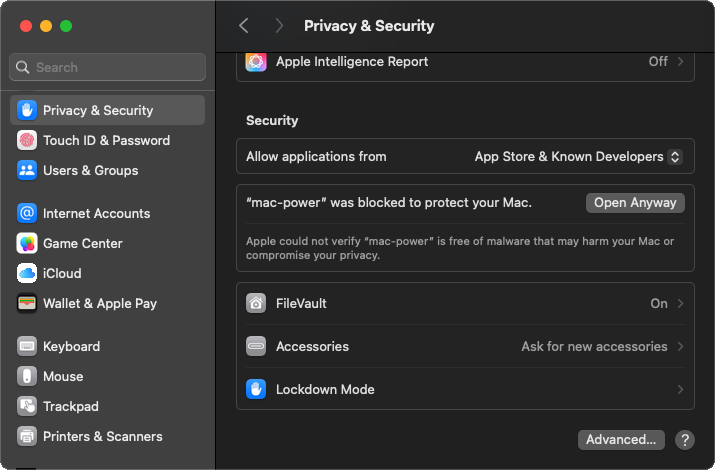

# Apple MacBook Power Details

Use your MacBook as a USB-PD tester.

Tested only on a MacBook Pro with M4 Pro chip, running MacOS Sequoia 15.7.1. It may run and work on other hardware, but you may need to run or compile using [Bun](https://bun.com) (a fast all-in-one JavaScript runtime).


## Usage:

Download and double-click the `mac-power` executable file.

You will likely see the following warning:



Click `Done`, then open MacOS `System Settings` and then choose the `Privacy & Security` section in the left pane.

Scroll to the bottom to the `Security` section, then click `Open Anyway` next to `"mac-power" was blocked to protect your Mac.`:



If it still won't open, run the following command to remove it from MacOS quarantine:

`xattr -d com.apple.quarantine ./mac-power`

To make the Terminal window close automatically:

In the Terminal app menu bar, click Preferences > Profiles.

Click Basic profile, then the Shell tab.

For `When the shell exits` choose `Close if the shell exited cleanly`.

## Usage from CLI:

Download the `mac-power` file.

Make it executable by running: `chmod +x ./mac-power`

Remove it from quarantine: `xattr -d com.apple.quarantine ./mac-power`

Run `./mac-power`

Your default browser should automatically open the app at http://localhost:3000

## Development

Install [Bun](https://bun.com)

Install dependencies:

```bash
bun install
```

To start a development server:

```bash
bun dev
```

To run for production:

```bash
bun start
```

To compile:

```bash
bun run compile
```
