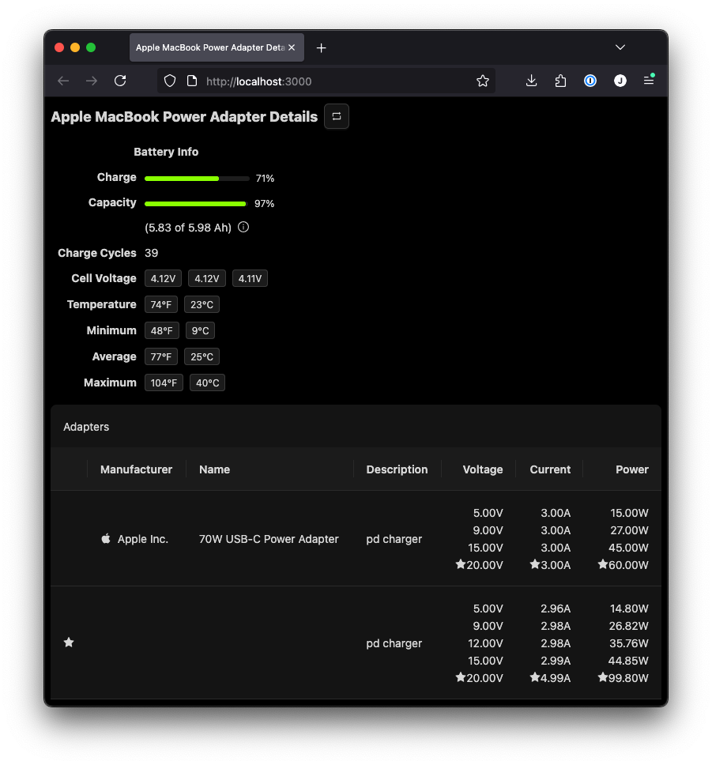

# Apple MacBook Power Details

Use your MacBook as a USB-PD tester.

Tested only on a MacBook Pro with M4 Pro chip, running MacOS Sequoia 15.7.1. It may run and work on other hardware, but you may need to run or compile using [Bun](https://bun.com) (a fast all-in-one JavaScript runtime).



## Usage:

Run `./mac-power`

Your default browser should automatically open the app at http://localhost:3000

## Development

Install [Bun](https://bun.com)

Install dependencies:

```bash
bun install
```

To start a development server:

```bash
bun dev
```

To run for production:

```bash
bun start
```

To compile:

```bash
bun run compile
```

This project was created using `bun init` in bun v1.3.0. [Bun](https://bun.com) is a fast all-in-one JavaScript runtime.
